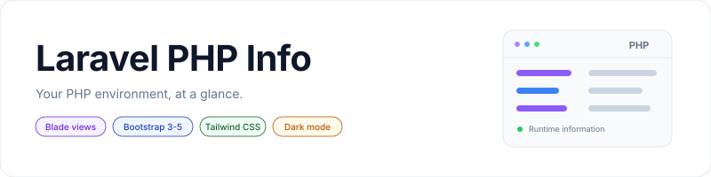

<p align="center">
    <picture>
        <source media="(prefers-color-scheme: dark)" srcset="art/banner-dark.svg">
        <source media="(prefers-color-scheme: light)" srcset="art/banner-light.svg">
        
    </picture>
</p>

<p align="center">PHP configuration, extensions, and runtime details in an authenticated Laravel page.</p>

<p align="center">
    <a href="https://packagist.org/packages/jeremykenedy/laravel-phpinfo"></a>
    <a href="https://packagist.org/packages/jeremykenedy/laravel-phpinfo"></a>
    <a href="https://github.com/jeremykenedy/laravel-phpinfo/actions/workflows/tests.yml"></a>
    <a href="https://github.styleci.io/repos/120066993"></a>
    <a href="LICENSE"></a>
</p>

## Table of Contents

- [Framework Support](#framework-support)
- [Requirements](#requirements)
- [Installation](#installation)
- [Quick Start](#quick-start)
- [Features](#features)
- [Configuration](#configuration)
- [Changing Frameworks](#changing-frameworks)
- [Artisan Commands](#artisan-commands)
- [Testing](#testing)
- [License](#license)

## Framework Support

| CSS framework | Application Blade layout | Standalone Blade page |
| --- | --- | --- |
| Bootstrap 3 | Supported | Supported |
| Bootstrap 4 | Default | Supported |
| Bootstrap 5 | Supported | Supported |
| Tailwind CSS | Supported | Supported |

The page is rendered on the server with Blade. Livewire, Vue, React, and Svelte applications can link to the same authenticated page; no separate client components or frontend dependencies are required.

Running `composer update` keeps Bootstrap 4 as the default. Existing Bootstrap 3 settings, custom layouts, and published views keep working. Framework changes happen only when you change configuration or run a setup command.

## Requirements

- Laravel 5.3 through 13, with the PHP version required by your Laravel release.
- PHP's `phpinfo` function enabled to display runtime details. A disabled function produces an explanation on the page.
- An application layout with a `content` section, or the `standalone` view option.

The existing Composer PHP constraint remains unchanged. The test matrix covers legacy applications as well as current Laravel releases. See [testing and compatibility](docs/testing.md) for the exact combinations. Older framework versions are tested for compatibility, but are no longer maintained upstream.

## Installation

```bash
composer require jeremykenedy/laravel-phpinfo
php artisan phpinfo:install
```

Setup asks for a CSS framework, layout, and default appearance. For unattended installation:

```bash
php artisan phpinfo:install --css=bootstrap4 --view=app --theme=system --no-interaction
```

An existing installation is detected without replacing its files. Use `phpinfo:update` to change display settings. `--force` reruns installation, but still preserves existing config and views.

Laravel 5.5 and newer discover the service provider automatically. On Laravel 5.3 and 5.4, add this provider to `config/app.php`:

```php
'providers' => [
    jeremykenedy\LaravelPhpInfo\LaravelPhpInfoServiceProvider::class,
],
```

The original publish command is still available:

```bash
php artisan vendor:publish --tag=laravelPhpInfo
```

Translations publish to the application's language directory, including `lang/vendor/laravelPhpInfo` on newer Laravel installations. See [upgrading](docs/upgrading.md) if an older release created `resources/lang/vendor/laravelPhpInfo` on Laravel 9 or later.

## Quick Start

Sign in to your application and visit `/phpinfo`. The route name remains `laravelPhpInfo::phpinfo`.

Blade and Livewire views:

```blade
<a href="{{ route('laravelPhpInfo::phpinfo') }}">PHP Information</a>
```

Vue:

```vue
<template>
    <a href="/phpinfo">PHP Information</a>
</template>
```

React:

```jsx
export default function PhpInfoLink() {
    return <a href="/phpinfo">PHP Information</a>;
}
```

Svelte:

```svelte
<a href="/phpinfo">PHP Information</a>
```

Use ordinary page navigation for this server-rendered route. If your application has no Blade layout, select the self-contained page:

```bash
php artisan phpinfo:update --view=standalone
```

For applications installed under a subdirectory, pass the named route URL from Laravel to your client instead of hardcoding `/phpinfo`.

## Features

- Existing Bootstrap 3 and 4 support, with Bootstrap 5 and Tailwind options.
- Application or standalone layouts.
- Light, dark, and system appearance with a saved browser preference.
- Search by extension, directive, or value without sending runtime data elsewhere.
- Responsive tables, labelled controls, and keyboard focus indicators.
- Authentication enabled by default, with optional role middleware.
- Configurable layouts, card classes, translations, and published views.
- Install, update, and switch commands that preserve application configuration.

## Configuration

Publish only the configuration when needed:

```bash
php artisan vendor:publish --tag=laravelPhpInfo-config
```

All existing keys in `config/laravelPhpInfo.php` retain their names, including the original spellings of `bootstapVersion` and `rolesMiddlware`.

| Option | Default | Purpose |
| --- | --- | --- |
| `laravelPhpInfoBladeExtended` | `layouts.app` | Parent Blade layout for the `app` view. |
| `authEnabled` | `true` | Apply the application's `auth` middleware. |
| `rolesEnabled` | `false` | Apply the configured role middleware. |
| `rolesMiddlware` | `role:admin` | Role middleware name, including any parameters. |
| `bootstapVersion` | `4` | Original Bootstrap selector. `3` selects panels; `4` selects cards. |
| `bootstrapCardClasses` | Empty string | Additional outer card classes. |
| `usePHPinfoCSS` | `true` | Load the package stylesheet. |
| `cssFramework` | `null` | `bootstrap3`, `bootstrap4`, `bootstrap5`, or `tailwind`. Null uses `bootstapVersion`. |
| `view` | `app` | `app` or `standalone`. |
| `theme` | `system` | Default appearance: `system`, `light`, or `dark`. |

The setup commands store only display choices in `config/laravelPhpInfoUi.php`. That managed file takes precedence over the three display options above. They never rewrite `config/laravelPhpInfo.php`, `.env`, authentication settings, or role settings. Remove the managed file if you want the main config to control display options again, then clear your config cache.

System appearance follows the browser preference and recognizes the host's `.dark`, `data-bs-theme`, and `data-theme` settings. An explicit choice in the page affects only PHP Info and is saved under `laravelPhpInfo.theme` in browser storage. The page still renders with JavaScript or browser storage disabled.

PHP information can contain environment variables, paths, and credentials. Keep authentication enabled and use role middleware or equivalent application authorization to restrict access to trusted administrators.

## Changing Frameworks

Run the interactive update command:

```bash
php artisan phpinfo:update
```

Or select options directly:

```bash
php artisan phpinfo:update --css=bootstrap5 --view=standalone
```

Use the quick switch command for a single setting:

```bash
php artisan phpinfo:switch --css=tailwind
php artisan phpinfo:switch --theme=dark
```

| Option | Values | Update | Switch |
| --- | --- | --- | --- |
| `--css=` | `bootstrap3`, `bootstrap4`, `bootstrap5`, `tailwind` | Optional | Optional |
| `--view=` | `app`, `standalone` | Optional | Optional |
| `--theme=` | `system`, `light`, `dark` | Optional | Optional |
| `--frontend=` | `blade` | Optional | Optional |
| `--ui-kit` | Configure an installed Laravel UI Kit package | Optional | Optional |
| `--refresh-views` | Back up and replace published package views | Optional | Optional |

Update prompts only when no display flags are supplied. Switch requires at least one of `--css`, `--view`, or `--theme`. Unspecified settings retain their current values. Both commands clear compiled views and cached configuration. Rebuild the config cache afterward if your deployment uses it.

Published views are preserved by default. They may contain their own framework markup and therefore ignore new display choices. To adopt the current templates, use:

```bash
php artisan phpinfo:update --css=bootstrap5 --refresh-views
```

The existing view directory is copied to a timestamped sibling backup before templates are replaced. Keep that backup until you have reapplied any customizations.

The package serves its own CSS and JavaScript through `/phpinfo/assets/`. No CDN or asset publication is required. Bootstrap and Tailwind wrappers use your application's chosen framework; the package stylesheet also makes the standalone view usable without a build step. If your application bundles framework CSS, update that dependency and run `npm run build` after switching.

For Tailwind 4, include the package views in your CSS source detection:

```css
@source "../../vendor/jeremykenedy/laravel-phpinfo/src";
```

For Tailwind 3, add `./vendor/jeremykenedy/laravel-phpinfo/src/**/*.php` to `content` in `tailwind.config.js`. Include the full source directory because wrapper classes are selected in PHP.

[Laravel UI Kit](https://github.com/jeremykenedy/laravel-ui-kit) is optional. Install it separately if your application needs its components, then opt into configuring it with PHP Info:

```bash
composer require jeremykenedy/laravel-ui-kit
php artisan phpinfo:update --css=bootstrap5 --ui-kit
```

This calls UI Kit's install or update command with the selected CSS framework and Blade frontend. It changes the host's UI Kit settings, so use it only when those choices match your application. It requires a Laravel/PHP version supported by UI Kit and does not support Bootstrap 3. No other optional package is required.

## Artisan Commands

| Command | Description | Flags |
| --- | --- | --- |
| `phpinfo:install` | Set up the package; detect existing installation. | `--css`, `--frontend`, `--view`, `--theme`, `--force`, `--ui-kit`, `--refresh-views` |
| `phpinfo:update` | Select display options interactively or with flags. | `--css`, `--frontend`, `--view`, `--theme`, `--ui-kit`, `--refresh-views` |
| `phpinfo:switch` | Change display options with flags. | `--css`, `--frontend`, `--view`, `--theme`, `--ui-kit`, `--refresh-views` |

Install options:

| Flag | Description |
| --- | --- |
| `--css=` | CSS framework: `bootstrap3`, `bootstrap4`, `bootstrap5`, or `tailwind`. |
| `--frontend=` | `blade`, the page renderer. |
| `--view=` | Use the host layout (`app`) or the package page (`standalone`). |
| `--theme=` | Default appearance: `system`, `light`, or `dark`. |
| `--force` | Rerun setup when already installed, preserving existing config and views. |
| `--ui-kit` | Also configure a separately installed Laravel UI Kit package. |
| `--refresh-views` | Back up published views, then copy the package templates. |
| `--no-interaction` | Use flags and current defaults without prompting. Available on all commands. |

Publication tags:

| Tag | Files |
| --- | --- |
| `laravelPhpInfo` | Configuration, views, and translations. |
| `laravelPhpInfo-config` | `config/laravelPhpInfo.php`. |
| `laravelPhpInfo-views` | `resources/views/vendor/laravelPhpInfo`. |
| `laravelPhpInfo-lang` | `vendor/laravelPhpInfo` inside the application's language directory. |

## Testing

Package development uses PHP 8.2 or newer:

```bash
composer install
composer check
npm ci
npx playwright install chromium
npm test
```

The PHP suite covers access controls, rendering, published overrides, translation paths, setup commands, and preservation of existing files. Browser tests cover all four CSS options, search, dark mode, mobile layout, storage restrictions, accessibility, and real `phpinfo()` output.

See [testing and compatibility](docs/testing.md), [upgrading](docs/upgrading.md), and the [changelog](CHANGELOG.md) for details.

## License

This package is open-sourced software licensed under the [MIT license](LICENSE).
